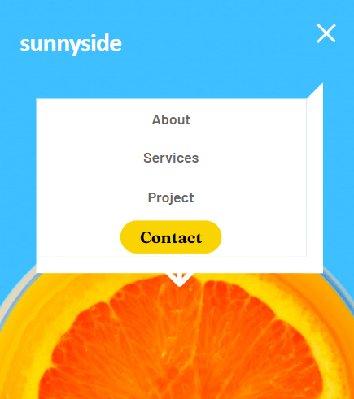

# Frontend Mentor - Sunnyside agency landing page solution

This is a solution to the [Sunnyside agency landing page challenge on Frontend Mentor](https://www.frontendmentor.io/challenges/sunnyside-agency-landing-page-7yVs3B6ef). Frontend Mentor challenges help you improve your coding skills by building realistic projects.

## Table of contents

- [Overview](#overview)
  - [The challenge](#the-challenge)
  - [Screenshot](#screenshot)
  - [Links](#links)
- [My process](#my-process)
  - [Built with](#built-with)
- [Author](#author)

## Overview
Frontend Challenge by frontendmentor.io completed building a landing page
### The challenge

Users should be able to:

- View the optimal layout for the site depending on their device's screen size
- See hover states for all interactive elements on the page

### Screenshot

### Links

- Solution URL: 
- Live Site URL: 

## My process
### Built with

- Semantic HTML5 markup
- CSS custom properties
- Flexbox
- CSS Grid

## Author

- Website - [Sahil Dhillon](https://sahil-dhillon.github.io/)
- Frontend Mentor - [@Sahil-Dhillon](https://www.frontendmentor.io/profile/Sahil-Dhillon)
- Twitter - [@zsahildhillon](https://www.twitter.com/zsahildhillon)

- Instagram - [@zsahildhillon](https://www.instagram.com/zsahildhillon)
